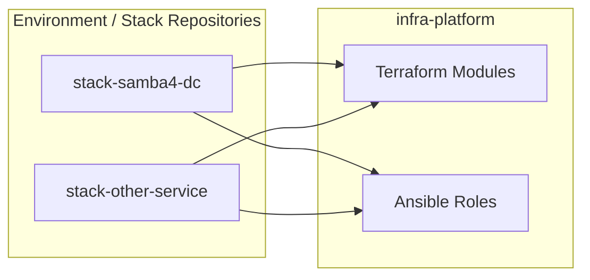
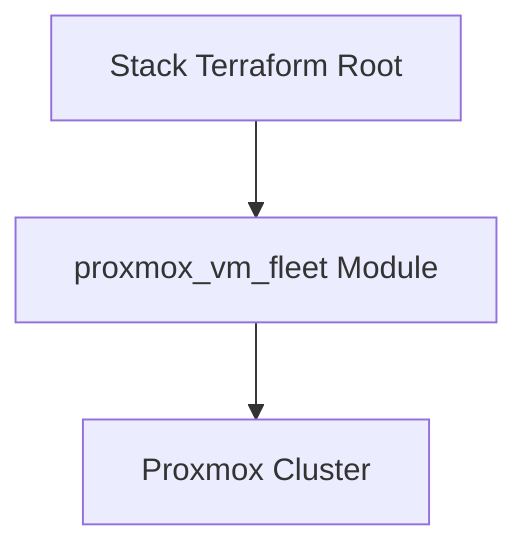
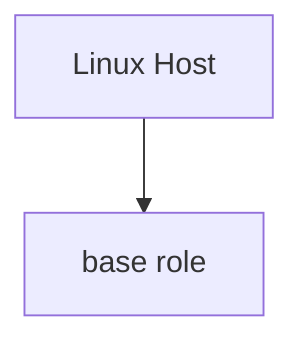
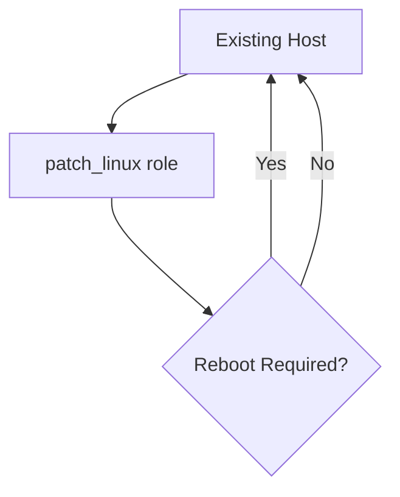

# infra-platform

This repository contains reusable infrastructure building blocks used by multiple environment-specific stacks in my homelab.

It intentionally contains no environment-specific configuration and no direct deployments.
All components here are versioned, composable, and consumed by stack repositories.

---

## Purpose

infra-platform exists to:

1. Avoid duplication of Terraform and Ansible code across stacks
2. Centralize baseline behavior (Linux configuration, users, packages, patching)
3. Enable safe upgrades via explicit version pinning from stack repositories

Nothing in this repository should assume:
- a specific hostname
- a specific IP range
- a specific environment (prod, lab, dev)

---

## Architectural Role

infra-platform provides **capabilities**, while stack repositories define **intent**.

---

## Contents

### Terraform Modules

Reusable Terraform modules only (no root deployments):

- terraform/modules/proxmox_vm_fleet
  - Provisions one or more Proxmox VMs from a template
  - Supports static IP configuration via cloud-init
  - Exposes structured outputs for Ansible inventory generation

---

### Ansible Roles

#### base
Baseline Linux configuration role.

Responsibilities:
- Install baseline packages
- Configure timezone
- Ensure admin user exists
- Install SSH authorized keys
- Configure optional passwordless sudo

Admin password handling:
- If admin_password_plain is defined, the password is set
- If not defined, the user is ensured without modifying the password

This makes the role safe for both provisioning and maintenance workflows.

---

#### patch_linux
Maintenance-only role for updating existing systems.

Responsibilities:
- Update apt cache
- Apply package upgrades
- Autoremove unused packages
- Reboot only when required

Designed for rolling updates and safe use on critical systems such as domain controllers.

---

## Versioning

This repository is versioned using Git tags.

Stacks explicitly pin versions using:
- Terraform module source refs (?ref=vX.Y.Z)
- Workflow-level git clones pinned to a tag

No changes propagate automatically to stacks.

---

## What Does Not Belong Here

- Environment-specific variables
- Inventory files
- Secrets or vault files
- Terraform state
- CI pipelines that apply infrastructure

This repository provides capabilities, not deployments.

---

## Philosophy

Infrastructure should be boring, predictable, and upgradeable on purpose.
